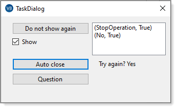
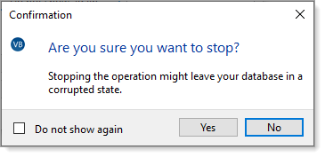
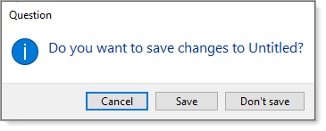
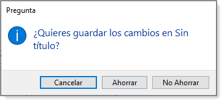
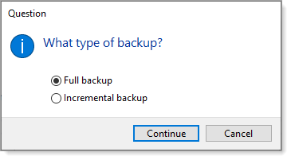
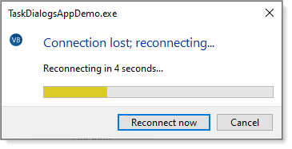
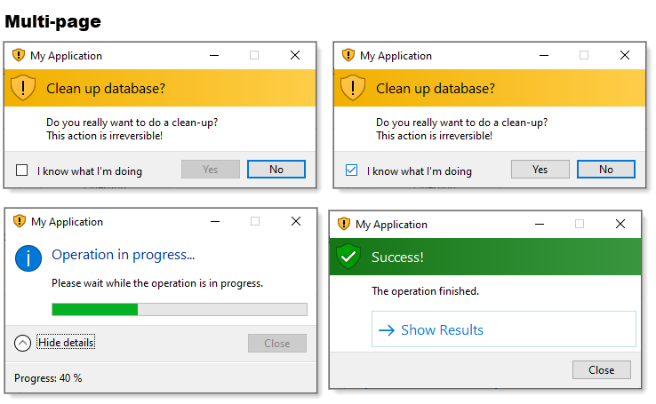

# About

This repository shows how to present various ways to communicate with users in Windows forms in place of MessageBox.

Using [TaskDialogPage](https://docs.microsoft.com/en-us/dotnet/api/system.windows.forms.taskdialogpage?view=windowsdesktop-6.0) provides options to control button position, text, caption and icon, add in Radio Button controls, auto close dialogs and much more.

Some of these samples originated from Microsoft, modified along with extracting code from a form and placing code into a class project for ease of use in any project.

A seldom needed requirement, present a dialog and allow the user to click a CheckBox to indicate never to show the dialog again. This operation as presented uses a json file to remember this setting along with storage of other properties so not to hard code text for caption, buttons and text to display.

# Requires

.NET Core 5x or higher

# Screenshots

 

 

 

 

